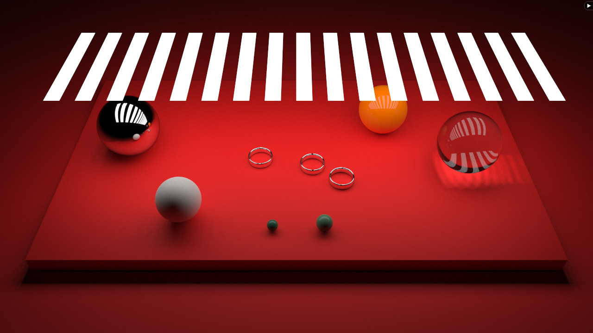
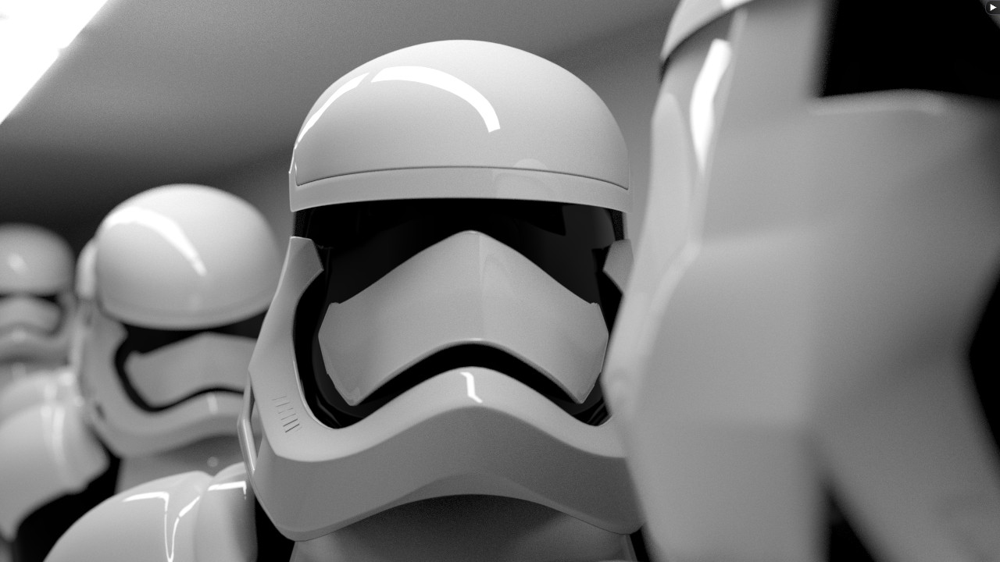
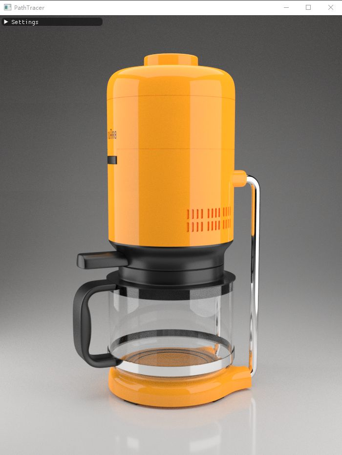
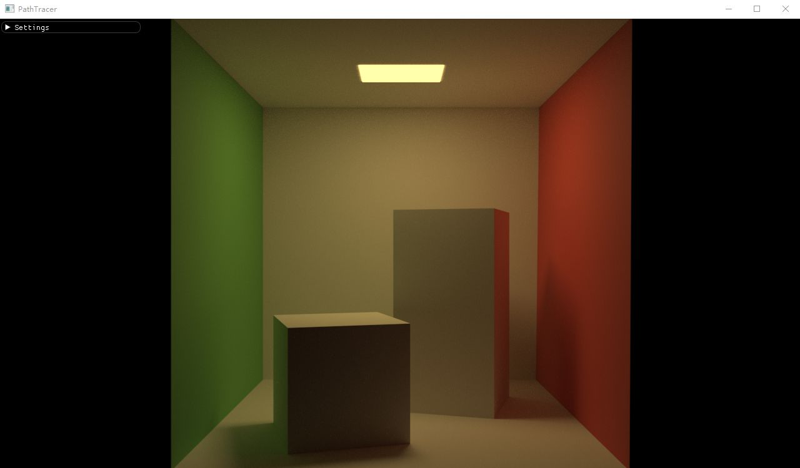
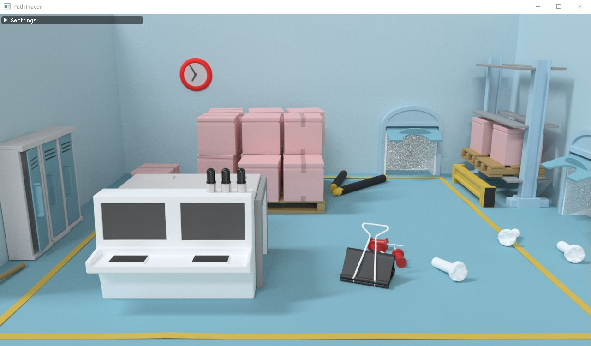
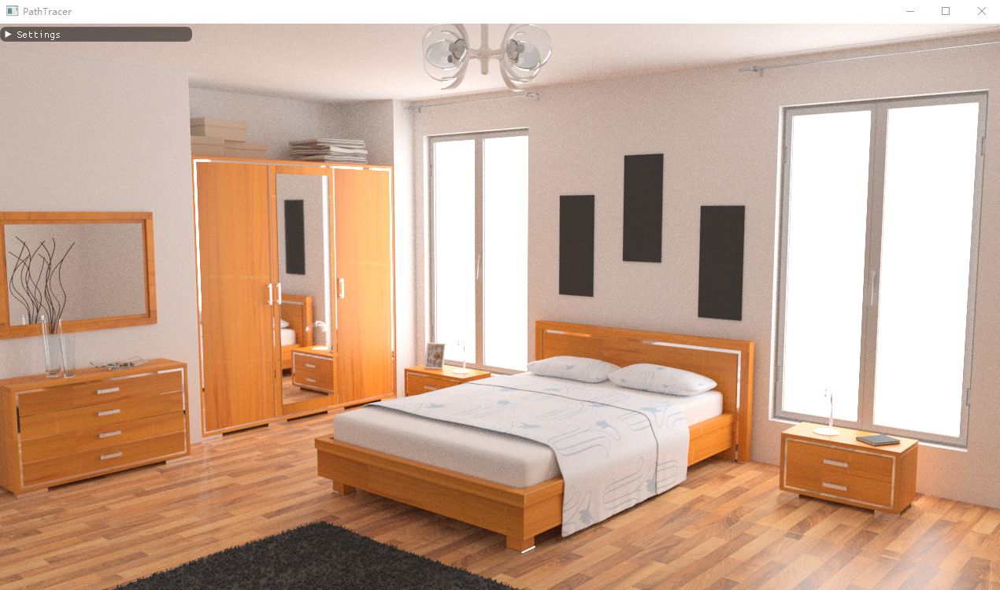
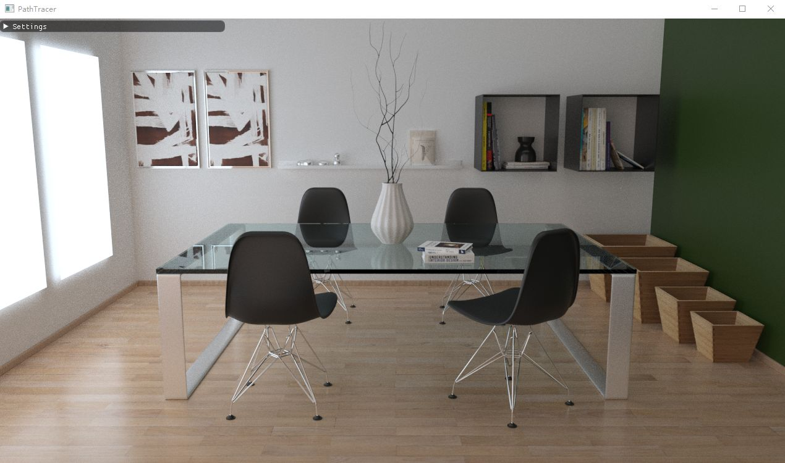
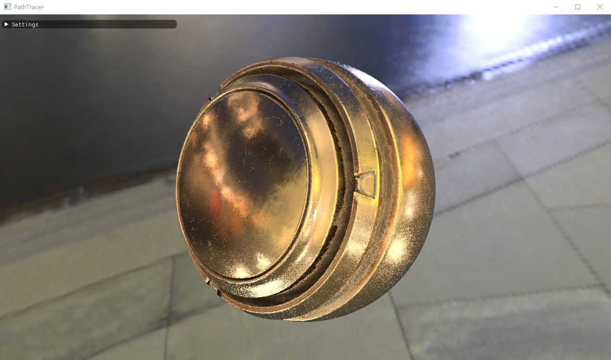
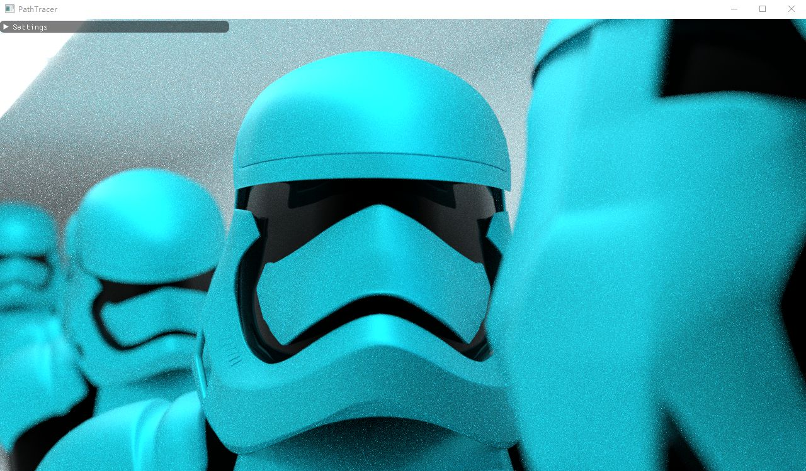

## GLSL-PathTracer

A physically based Path Tracer that runs in a GLSL Fragment shader. 

This repo modified from the original repo： https://github.com/knightcrawler25/GLSL-PathTracer

## Build

Support for `Windows`、`MacOS`、`Ubuntu` and test pass.

```bash
git clone https://github.com/BobLChen/PathTracer.git
cd PathTracer
mkdir build
cd build
cmake ..
make
```

## Features

- Unidirectional PathTracing
- RadeonRays for building BVHs (Traversal is performed in a shader)
- Metallic-Roughness Material Model
- Texture Mapping (Albedo, Metallic, Roughness, Normal maps)
- Spherical and Rectangular Area Lights
- IBL with importance sampling
- Progressive + Tiled Rendering (Reduces GPU usage and timeout when depth/scene complexity is high)

## TODO

- Support for different texture sizes
- Support for different model format
- Support for different light types
- Support for different material model

## Sample Scenes
These assets modified from the origin repo.
Link to origin repo:https://github.com/knightcrawler25/GLSL-PathTracer
Assets:https://drive.google.com/file/d/1SK9fRyzvpHBNBFb0Gc6nDvDkH7AHVj6H/view?usp=sharing

## Screenshots


















